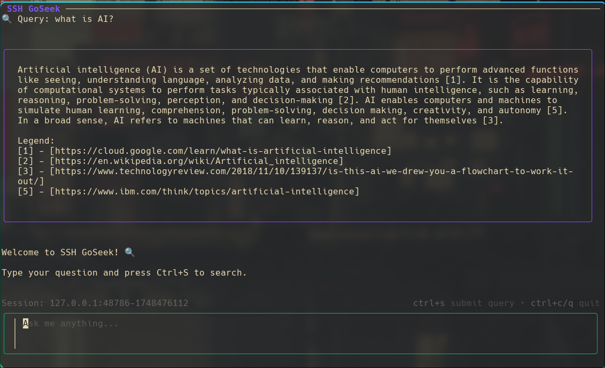

# GoSeek

An ssh app that searches the web to provide LLM answers, straight to the terminal.

## Usage

- Populate the `.env` file
- `make run`
- `ssh localhost -p 23234`
- Ask away!

## To-do

### Performance

- [x] Concurrent Scraping
- [ ] Concurrent chunking

### Scalability

- [ ] Distribute
- [ ] Use a MQ for comms
