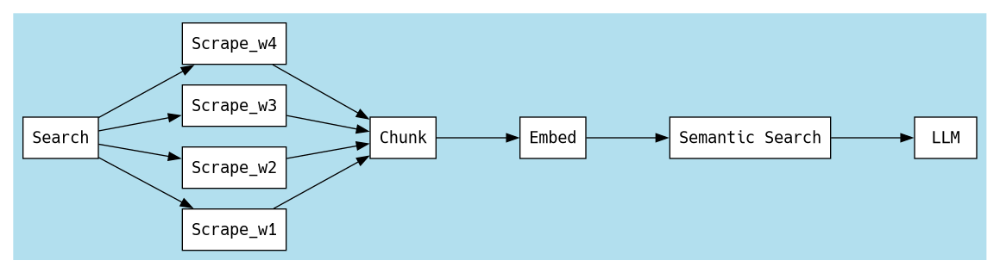

# GoSeek

An ssh app that searches the web to provide LLM answers, straight to the terminal.

## Usage

- Populate the `.env` file
- `make run`
- `ssh localhost -p 23234`
- Ask away!

## Data Flow

## To-do

## Features

- [ ] Data Persistance
- [ ] User Management/Auth

## Code Quality

- [x] Modular
- [ ] Better error handling
- [ ] Better logging

### Performance

- [x] Concurrent Scraping
- [ ] Concurrent chunking
- [ ] Remove Data Model conversions

### Scalability

- [ ] Distribute
- [ ] Use a MQ for comms
